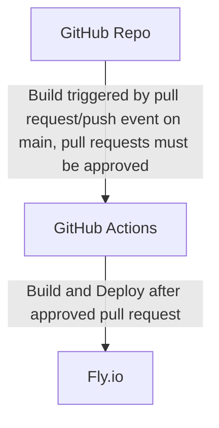

## Bloglist app with CI/CD pipeline

This is the bloglist app with CI/CD pipeline for tasks 11.20-11.21.
The pokedex repo of previous excercises: https://github.com/CrownFist/full-stack-open-pokedex

